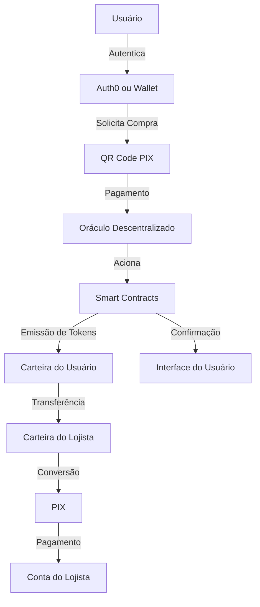
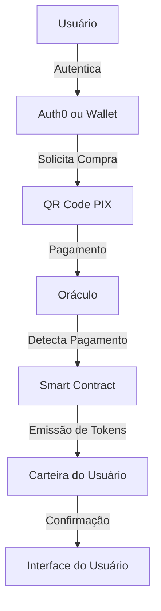
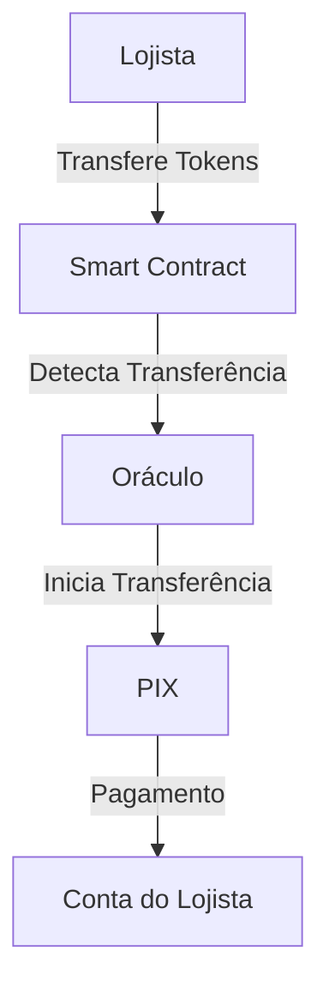

# nrisimhadeva

# Protocolo NRISIMHADEVA

[License: MIT
[Contributions welcome

O Protocolo NRISIMHADEVA é uma solução descentralizada open-source que conecta o sistema financeiro tradicional (PIX) ao mundo blockchain, permitindo a conversão bidirecional entre moeda fiduciária (BRL) e tokens digitais sem necessidade de banco de dados centralizado.

## Índice

- [Visão Geral](#visão-geral)
- [Arquitetura](#arquitetura)
- [Fluxos de Transação](#fluxos-de-transação)
  - [Compra de Tokens](#compra-de-tokens-usuário--administração)
  - [Venda de Tokens](#venda-de-tokens-lojista--administração)
- [Tecnologias](#tecnologias)
- [Smart Contracts](#smart-contracts)
- [Oráculos](#oráculos)
- [Instalação](#instalação)
- [Contribuição](#contribuição)
- [Licença](#licença)

## Visão Geral

O NRISIMHADEVA é um protocolo descentralizado que permite:

1. **Compra de Tokens**: Usuários podem adquirir tokens digitais através de pagamentos PIX.
2. **Transferência P2P**: Tokens podem ser transferidos livremente entre carteiras.
3. **Venda de Tokens**: Lojistas podem converter tokens de volta para BRL via PIX.

Todas as informações necessárias são armazenadas diretamente na blockchain, eliminando a necessidade de banco de dados centralizado e aumentando a transparência e auditabilidade do sistema.

## Arquitetura

O protocolo opera com uma arquitetura totalmente descentralizada:

- **Smart Contracts**: Gerenciam a emissão, transferência e queima de tokens.
- **Oráculos Descentralizados**: Monitoram pagamentos PIX e acionam os smart contracts.
- **Autenticação Descentralizada**: Integração com Auth0 para gerenciamento de identidade.
- **Armazenamento On-Chain**: Todas as informações relevantes são armazenadas na blockchain.

## Fluxos de Transação

### Compra de Tokens (Usuário → Administração)

1. **Autenticação do Usuário**
   - O usuário se autentica via Auth0 ou via Wallet, que associa sua identidade à sua carteira blockchain.

2. **Solicitação de Compra**
   - O usuário especifica o valor em BRL que deseja converter em tokens.
   - O sistema gera um QR Code PIX contendo:
     - A chave PIX da administração do protocolo
     - O endereço da carteira do usuário no campo `solicitacaoPagador`

3. **Pagamento e Emissão**
   - O usuário efetua o pagamento via PIX usando o QR Code gerado.
   - O oráculo descentralizado monitora a conta PIX da administração.
   - Ao detectar o pagamento, o oráculo extrai o endereço da carteira do campo `solicitacaoPagador`.
   - O oráculo aciona o smart contract para emitir tokens equivalentes (1 token = R$1).
   - Os tokens são transferidos automaticamente para a carteira do usuário.

4. **Confirmação**
   - O usuário recebe confirmação da transação na interface e pode verificar o saldo atualizado de tokens em sua carteira.

### Venda de Tokens (Lojista → Administração)

1. **Transferência de Tokens**
   - O lojista transfere tokens de sua carteira para a carteira de administração do protocolo.
   - Esta transferência inclui metadados com a chave PIX do lojista.

2. **Detecção e Processamento**
   - O smart contract detecta a transferência de tokens para a carteira de administração.
   - O contrato emite um evento contendo:
     - O endereço da carteira do lojista
     - A quantidade de tokens transferidos
     - A chave PIX do lojista (extraída dos metadados)

3. **Conversão e Pagamento**
   - O oráculo monitora eventos do smart contract.
   - Ao detectar o evento de venda, o oráculo:
     - Calcula o valor em BRL correspondente aos tokens (1 token = R$1)
     - Inicia uma transferência PIX para a chave do lojista
     - Confirma a transação no smart contract

4. **Finalização**
   - Os tokens transferidos são queimados pelo smart contract.
   - O lojista recebe o valor correspondente em sua conta bancária via PIX.
   - O evento de queima é registrado na blockchain para auditoria.



### Fluxos de Transação

#### Compra de Tokens



#### Venda de Tokens



## Tecnologias

- **Blockchain**: Ethereum, Polygon ou BSC (configurável)
- **Smart Contracts**: Solidity 0.8.x
- **Oráculos**: Chainlink
- **Autenticação**: Auth0
- **Frontend**: React.js
- **API Gateway**: Node.js

## Smart Contracts

O protocolo utiliza dois contratos principais:

### NrisimhadevaToken.sol

```solidity
// SPDX-License-Identifier: MIT
pragma solidity ^0.8.0;

import "@openzeppelin/contracts/token/ERC20/ERC20.sol";
import "@openzeppelin/contracts/access/AccessControl.sol";

contract NrisimhadevaToken is ERC20, AccessControl {
    bytes32 public constant ORACLE_ROLE = keccak256("ORACLE_ROLE");
    bytes32 public constant ADMIN_ROLE = keccak256("ADMIN_ROLE");
    
    // Mapping to store PIX keys for redemption
    mapping(address => string) public pixKeys;
    
    event TokensIssued(address indexed to, uint256 amount, string transactionId);
    event TokensRedeemed(address indexed from, uint256 amount, string pixKey);
    
    constructor() ERC20("Nrisimhadeva Token", "NVD") {
        _setupRole(DEFAULT_ADMIN_ROLE, msg.sender);
        _setupRole(ADMIN_ROLE, msg.sender);
    }
    
    // Register PIX key for a wallet
    function registerPixKey(string calldata pixKey) external {
        pixKeys[msg.sender] = pixKey;
    }
    
    // Issue tokens after PIX payment confirmation
    function issueTokens(address to, uint256 amount, string calldata transactionId) 
        external onlyRole(ORACLE_ROLE) {
        _mint(to, amount * 10 ** decimals());
        emit TokensIssued(to, amount, transactionId);
    }
    
    // Redeem tokens for PIX payment
    function redeemTokens(uint256 amount) external {
        require(balanceOf(msg.sender) >= amount * 10 ** decimals(), "Insufficient balance");
        require(bytes(pixKeys[msg.sender]).length > 0, "No PIX key registered");
        
        _burn(msg.sender, amount * 10 ** decimals());
        emit TokensRedeemed(msg.sender, amount, pixKeys[msg.sender]);
    }
    
    // Admin can add oracle addresses
    function addOracle(address oracle) external onlyRole(ADMIN_ROLE) {
        grantRole(ORACLE_ROLE, oracle);
    }
}
```

## Oráculos

O protocolo utiliza oráculos Chainlink para:

1. **Monitoramento de Pagamentos PIX**
   - Detectar pagamentos recebidos
   - Extrair o endereço da carteira do campo `solicitacaoPagador`
   - Acionar o smart contract para emissão de tokens

2. **Processamento de Resgates**
   - Detectar eventos de resgate no smart contract
   - Iniciar transferências PIX para os lojistas
   - Confirmar a conclusão da transferência


### NrisimhadevaOracle.sol

```solidity
// SPDX-License-Identifier: MIT
pragma solidity ^0.8.0;

import "@chainlink/contracts/src/v0.8/ChainlinkClient.sol";
import "./NrisimhadevaToken.sol";

contract NrisimhadevaOracle is ChainlinkClient {
    using Chainlink for Chainlink.Request;
    
    address private tokenContract;
    address private owner;
    
    bytes32 private jobId;
    uint256 private fee;
    
    event PixPaymentProcessed(address indexed recipient, uint256 amount, string pixKey);
    
    constructor(address _tokenContract, address _link) {
        tokenContract = _tokenContract;
        owner = msg.sender;
        setChainlinkToken(_link);
        jobId = "your_job_id";
        fee = 0.1 * 10 ** 18; // 0.1 LINK
    }
    
    // Called by Chainlink node when PIX payment is detected
    function fulfillPixPayment(bytes32 _requestId, address _recipient, uint256 _amount, string memory _txId) 
        public recordChainlinkFulfillment(_requestId) {
        NrisimhadevaToken(tokenContract).issueTokens(_recipient, _amount, _txId);
    }
    
    // Called when tokens are redeemed for PIX payment
    function processRedemption(address _sender, uint256 _amount, string memory _pixKey) external {
        require(msg.sender == tokenContract, "Only token contract can call");
        
        Chainlink.Request memory req = buildChainlinkRequest(jobId, address(this), this.fulfillRedemption.selector);
        req.add("recipient", _pixKey);
        req.addUint("amount", _amount);
        req.add("sender", addressToString(_sender));
        
        sendChainlinkRequestTo(oracle, req, fee);
        
        emit PixPaymentProcessed(_sender, _amount, _pixKey);
    }
    
    // Callback for redemption confirmation
    function fulfillRedemption(bytes32 _requestId, bool _success) public recordChainlinkFulfillment(_requestId) {
        // Additional logic if needed
    }
    
    // Helper function to convert address to string
    function addressToString(address _addr) internal pure returns(string memory) {
        bytes32 value = bytes32(uint256(uint160(_addr)));
        bytes memory alphabet = "0123456789abcdef";
        
        bytes memory str = new bytes(42);
        str[0] = '0';
        str[1] = 'x';
        
        for (uint256 i = 0; i < 20; i++) {
            str[2+i*2] = alphabet[uint8(value[i + 12] >> 4)];
            str[3+i*2] = alphabet[uint8(value[i + 12] & 0x0f)];
        }
        
        return string(str);
    }
}
```

## Instalação

### Pré-requisitos

- Node.js v14+
- Yarn ou NPM
- Conta Infura ou outro provedor RPC
- Conta Chainlink para oráculos

### Configuração

1. **Clone o repositório**
   ```bash
   git clone https://github.com/nrisimhadeva/protocol.git
   cd protocol
   ```

2. **Instale as dependências**
   ```bash
   yarn install
   ```

3. **Configure as variáveis de ambiente**
   ```bash
   cp .env.example .env
   # Edite o arquivo .env com suas configurações
   ```

4. **Compile os smart contracts**
   ```bash
   yarn compile
   ```

5. **Deploy dos contratos**
   ```bash
   yarn deploy:network
   ```

6. **Inicie o frontend**
   ```bash
   yarn start
   ```

## Contribuição

Contribuições são bem-vindas! Por favor, leia nosso [guia de contribuição](CONTRIBUTING.md) antes de submeter pull requests.

1. Faça um fork do projeto
2. Crie sua branch de feature (`git checkout -b feature/amazing-feature`)
3. Commit suas mudanças (`git commit -m 'Add some amazing feature'`)
4. Push para a branch (`git push origin feature/amazing-feature`)
5. Abra um Pull Request

## Licença

Este projeto está licenciado sob a licença MIT - veja o arquivo [LICENSE](LICENSE) para detalhes.

