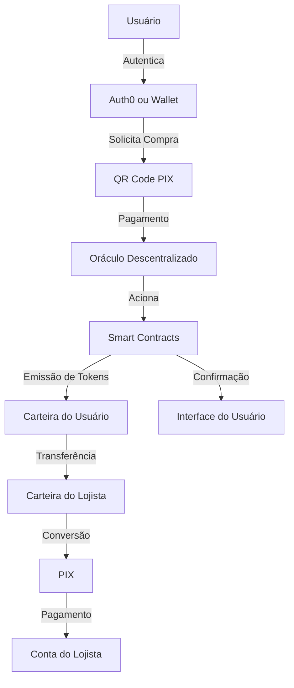
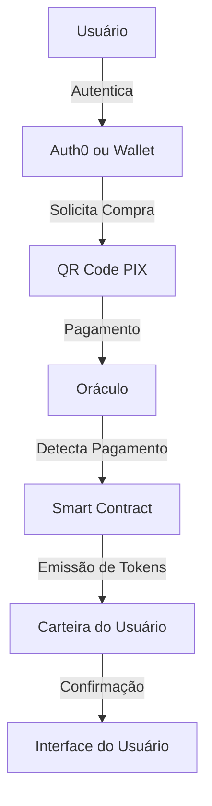
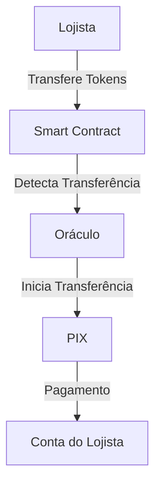

# nrisimhadeva

npm install --save-dev @cucumber/cucumber --registry https://registry.npmjs.org/


O Protocolo NRISIMHADEVA é uma solução descentralizada open-source que conecta o sistema financeiro tradicional (PIX) ao mundo blockchain, permitindo a conversão bidirecional entre moeda fiduciária (BRL) e tokens digitais sem necessidade de banco de dados centralizado.

## Índice

- [Visão Geral](#visão-geral)
- [Arquitetura](#arquitetura)
- [Fluxos de Transação](#fluxos-de-transação)
  - [Compra de Tokens](#compra-de-tokens-usuário--administração)
  - [Venda de Tokens](#venda-de-tokens-lojista--administração)
- [Tecnologias](#tecnologias)
- [Smart Contracts](#smart-contracts)
- [Oráculos](#oráculos)
- [Instalação](#instalação)
- [Contribuição](#contribuição)
- [Licença](#licença)

## Visão Geral

O NRISIMHADEVA é um protocolo descentralizado que permite:

1. **Compra de Tokens**: Usuários podem adquirir tokens digitais através de pagamentos PIX.
2. **Transferência P2P**: Tokens podem ser transferidos livremente entre carteiras.
3. **Venda de Tokens**: Lojistas podem converter tokens de volta para BRL via PIX.

Todas as informações necessárias são armazenadas diretamente na blockchain, eliminando a necessidade de banco de dados centralizado e aumentando a transparência e auditabilidade do sistema.

## Arquitetura

O protocolo opera com uma arquitetura totalmente descentralizada:

- **Smart Contracts**: Gerenciam a emissão, transferência e queima de tokens.
- **Oráculos Descentralizados**: Monitoram pagamentos PIX e acionam os smart contracts.
- **Autenticação Descentralizada**: Integração com Auth0 para gerenciamento de identidade.
- **Armazenamento On-Chain**: Todas as informações relevantes são armazenadas na blockchain.

```
nrisimhadeva/
├── README.md                     // Documentação geral do projeto
├── package.json                  // Dependências e scripts gerais
├── .env.example                  // Exemplo de variáveis de ambiente
├── .gitignore                    // Arquivos e pastas ignorados pelo Git
├── LICENSE                       // Licença do projeto (ex.: MIT)
├── CONTRIBUTING.md               // Guia de contribuição para desenvolvedores
└── src/
    ├── frontend/                 // Camada de apresentação (React)
    │   ├── package.json          // Dependências do frontend
    │   ├── public/
    │   │   ├── index.html        // Página HTML principal
    │   │   └── favicon.ico
    │   ├── index.js              // Ponto de entrada do React
    │   ├── App.jsx               // Componente raiz do aplicativo
    │   │   ├── App.feature       // Cenários BDD para o App
    │   │   └── App.steps.js      // Steps para o App
    │   ├── pages/                // Páginas da aplicação
    │   │   ├── Home.jsx
    │   │   │   ├── Home.feature  // Cenários BDD para a Home
    │   │   │   └── Home.steps.js // Steps para a Home
    │   │   ├── Login.jsx
    │   │   │   ├── Login.feature  // Cenários BDD para a página de login
    │   │   │   └── Login.steps.js // Steps para a página de login
    │   │   └── Dashboard.jsx
    │   │       ├── Dashboard.feature  // Cenários BDD para o Dashboard
    │   │       └── Dashboard.steps.js // Steps para o Dashboard
    │   ├── components/           // Componentes reutilizáveis
    │   │   ├── AuthComponent.jsx         
    │   │   ├── AuthComponent.feature     
    │   │   └── AuthComponent.steps.js    
    │   │   ├── QRCodeComponent.jsx       
    │   │   ├── QRCodeComponent.feature   
    │   │   └── QRCodeComponent.steps.js  
    │   │   ├── TokenBalance.jsx          
    │   │   ├── TokenBalance.feature      
    │   │   └── TokenBalance.steps.js     
    │   │   ├── TransactionHistory.jsx    
    │   │   ├── TransactionHistory.feature  
    │   │   └── TransactionHistory.steps.js  
    │   └── styles/               // Estilos globais e específicos (CSS/SCSS)
    │       └── main.css          // Estilo principal da aplicação
    │
    ├── blockchain/             // Código relacionado aos smart contracts e interações com blockchain
    │   ├── contracts/
    │   │   ├── NrisimhadevaToken.sol        // Contrato do token com funções de emissão e resgate
    │   │   ├── NrisimhadevaToken.feature    // Cenários BDD para o token
    │   │   ├── NrisimhadevaOracle.sol         // Contrato do oráculo para integração com Chainlink e PIX
    │   │   └── NrisimhadevaOracle.feature     // Cenários BDD para o oráculo
    │   ├── migrations/          // Scripts de deploy dos contratos inteligentes
    │   │   ├── 1_deploy_contracts.js       // Script de deploy dos contratos
    │   │   ├── 1_deploy_contracts.feature  // Cenários BDD para o deploy dos contratos
    │   │   └── 1_deploy_contracts.steps.js  // Steps para o deploy dos contratos
    │   └── scripts/             // Scripts auxiliares e helpers para interações com blockchain
    │       ├── deploy.js                  // Script para deploy manual dos contratos
    │       ├── deploy.feature             // Cenários BDD para o deploy manual
    │       └── deploy.steps.js            // Steps para o deploy manual

```

## Fluxos de Transação

### Compra de Tokens (Usuário → Administração)

1. **Autenticação do Usuário**
   - O usuário se autentica via Auth0 ou via Wallet, que associa sua identidade à sua carteira blockchain.

2. **Solicitação de Compra**
   - O usuário especifica o valor em BRL que deseja converter em tokens.
   - O sistema gera um QR Code PIX contendo:
     - A chave PIX da administração do protocolo
     - O endereço da carteira do usuário no campo `solicitacaoPagador`

3. **Pagamento e Emissão**
   - O usuário efetua o pagamento via PIX usando o QR Code gerado.
   - O oráculo descentralizado monitora a conta PIX da administração.
   - Ao detectar o pagamento, o oráculo extrai o endereço da carteira do campo `solicitacaoPagador`.
   - O oráculo aciona o smart contract para emitir tokens equivalentes (1 token = R$1).
   - Os tokens são transferidos automaticamente para a carteira do usuário.

4. **Confirmação**
   - O usuário recebe confirmação da transação na interface e pode verificar o saldo atualizado de tokens em sua carteira.

### Venda de Tokens (Lojista → Administração)

1. **Transferência de Tokens**
   - O lojista transfere tokens de sua carteira para a carteira de administração do protocolo.
   - Esta transferência inclui metadados com a chave PIX do lojista.

2. **Detecção e Processamento**
   - O smart contract detecta a transferência de tokens para a carteira de administração.
   - O contrato emite um evento contendo:
     - O endereço da carteira do lojista
     - A quantidade de tokens transferidos
     - A chave PIX do lojista (extraída dos metadados)

3. **Conversão e Pagamento**
   - O oráculo monitora eventos do smart contract.
   - Ao detectar o evento de venda, o oráculo:
     - Calcula o valor em BRL correspondente aos tokens (1 token = R$1)
     - Inicia uma transferência PIX para a chave do lojista
     - Confirma a transação no smart contract

4. **Finalização**
   - Os tokens transferidos são queimados pelo smart contract.
   - O lojista recebe o valor correspondente em sua conta bancária via PIX.
   - O evento de queima é registrado na blockchain para auditoria.



### Fluxos de Transação

#### Compra de Tokens



#### Venda de Tokens



## Tecnologias

- **Blockchain**: Ethereum, Polygon ou BSC (configurável)
- **Smart Contracts**: Solidity 0.8.x
- **Oráculos**: Chainlink
- **Autenticação**: Auth0
- **Frontend**: React.js
- **API Gateway**: Node.js

## Oráculos

O protocolo utiliza oráculos Chainlink para:

1. **Monitoramento de Pagamentos PIX**
   - Detectar pagamentos recebidos
   - Extrair o endereço da carteira do campo `solicitacaoPagador`
   - Acionar o smart contract para emissão de tokens

2. **Processamento de Resgates**
   - Detectar eventos de resgate no smart contract
   - Iniciar transferências PIX para os lojistas
   - Confirmar a conclusão da transferência

## Instalação

### Pré-requisitos

- Node.js v14+
- Yarn ou NPM
- Conta Infura ou outro provedor RPC
- Conta Chainlink para oráculos

### Configuração

1. **Clone o repositório**
   ```bash
   git clone https://github.com/govinda777/nrisimhadeva.git
   cd nrisimhadeva
   ```

2. **Instale as dependências**
   ```bash
   npm install --registry https://registry.npmjs.org/
   ```

3. **Configure as variáveis de ambiente**
   ```bash
   cp .env.example .env
   # Edite o arquivo .env com suas configurações
   ```

4. **Compile os smart contracts**
   ```bash
   npx hardhat compile
   ```

5. **Deploy dos contratos**
   ```bash
   npx hardhat deploy:network
   ```

6. **Inicie o frontend**
   ```bash
   npm start
   ```

## Contribuição

Contribuições são bem-vindas! Por favor, leia nosso [guia de contribuição](CONTRIBUTING.md) antes de submeter pull requests.

1. Faça um fork do projeto
2. Crie sua branch de feature (`git checkout -b feature/amazing-feature`)
3. Commit suas mudanças (`git commit -m 'Add some amazing feature'`)
4. Push para a branch (`git push origin feature/amazing-feature`)
5. Abra um Pull Request

## Licença

Este projeto está licenciado sob a licença MIT - veja o arquivo [LICENSE](LICENSE) para detalhes.

