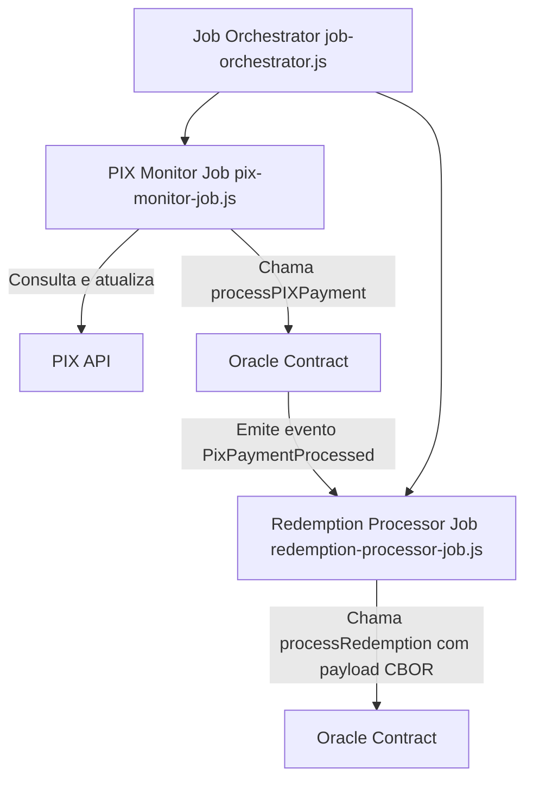

# Diretório de Jobs para o Protocolo NRISIMHADEVA

Este diretório contém scripts de trabalho que executam tarefas off-chain para a integração do Oracle NRISIMHADEVA:

- `job-orchestrator.js`: O script principal que inicia e orquestra o agendamento de jobs e os ouvintes de eventos.
- `pix-monitor-job.js`: Um job agendado que monitora transações PIX via API PIX a cada minuto, processa pagamentos on-chain através do contrato Oracle e marca as transações como processadas.
- `redemption-processor-job.js`: Um serviço de escuta para eventos de resgate emitidos pelo contrato Oracle, processa esses eventos e chama a respectiva função de resgate usando uma carga útil codificada em CBOR.

## Diagrama de Fluxo de Jobs

O diagrama a seguir resume a integração dos jobs do Oracle com o protocolo NRISIMHADEVA:



Este diagrama mostra que o orquestrador de jobs inicia os dois jobs. O job de monitoramento PIX consulta a API PIX e chama a função `processPIXPayment` do contrato Oracle, enquanto o job processador de resgate escuta o evento `PixPaymentProcessed` e chama a função `processRedemption` após processar a carga útil em CBOR.

## Configuração e Instalação

1. Certifique-se de que o projeto esteja configurado com as variáveis de ambiente necessárias criando um arquivo `.env` na raiz do projeto. As variáveis necessárias incluem:
   - `RPC_URL`: URL RPC do seu nó Ethereum (ex: fornecido pela Infura ou Alchemy).
   - `PRIVATE_KEY`: A chave privada da carteira usada para assinar transações blockchain.
   - `NRISIMHADEVA_ORACLE_ADDRESS`: O endereço implantado do contrato Oracle.
   - `PIX_API_URL`: O endpoint para a API de transações PIX.
   - `PIX_API_AUTH`: O token de autorização ou bearer token para a API PIX.

2. Instale as dependências executando:

   ```bash
   npm install --registry https://registry.npmjs.org/
   ```

3. Corrija problemas de auditoria

   ```bash
   npm audit fix --registry https://registry.npmjs.org/
   ```

4. Execute os jobs

   ```bash
   npm start
   ```

## Executando os Jobs

- Para iniciar o orquestrador de jobs, execute:

   ```bash
   npm start
   ```

- Para implantações em produção, considere usar um gerenciador de processos como o PM2 para garantir operação contínua:

   ```bash
   pm2 start src/jobs/job-orchestrator.js --name nrisimhadeva-oracle
   ```

## Registro e Tratamento de Erros

Cada script de job registra mensagens informativas e erros no console para facilitar o monitoramento e depuração. Verifique a saída do console para detalhes sobre a execução do job, transações blockchain e respostas da API.

## OAuth

```bash
curl -X POST \
    'https://api.mercadopago.com/oauth/token'\
    -H 'Content-Type: application/json' \
    -d '{
  "client_secret": "AAAAA",
  "client_id": "1111111",
  "grant_type": "client_credentials",
  "code": "TG-XXXXXXXX-241983636",
  "code_verifier": "AAAAA",
  "redirect_uri": "https://www.redirect-url.com?code=CODE&state=RANDOM_ID",
  "refresh_token": "TG-XXXXXXXX-241983636",
  "test_token": "false"
}'
```

> Resposta:

```json
{
   "access_token":"AAAAA",
   "token_type":"Bearer",
   "expires_in":21600,
   "scope":"offline_access payments read write",
   "user_id":111111,
   "live_mode":true
}
```